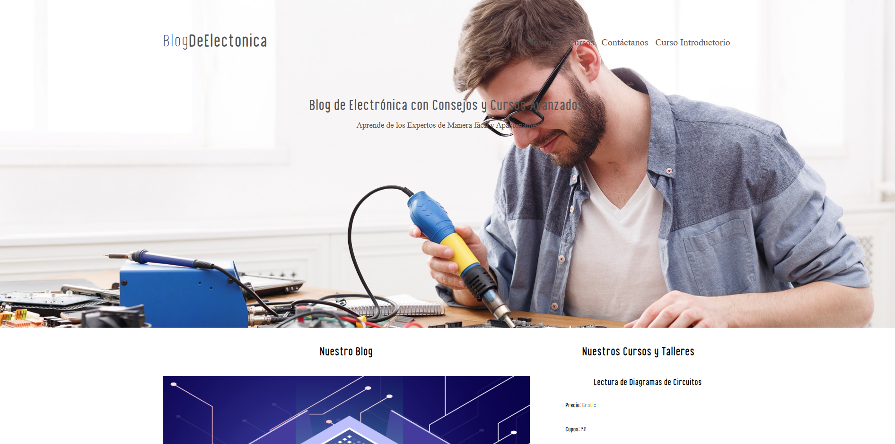

# Curso de Electricidad Básico



Este es un sitio web básico creado en PHP y CSS que proporciona información fundamental sobre electricidad. La página está diseñada para enseñar conceptos básicos de electricidad de forma sencilla y accesible.

## Descripción

La página incluye:

- Información sobre los principios de la electricidad.
- Explicaciones sobre circuitos, voltaje, corriente y resistencia.
- Ejemplos prácticos y visuales para facilitar el aprendizaje.

Este sitio fue creado con PHP y CSS puros y es ideal para aquellos que se inician en el estudio de la electricidad o desean un repaso rápido de los conceptos esenciales.

## Características

- **Diseño simple y accesible**: estructura clara y navegación fácil.
- **Compatibilidad**: funciona en navegadores modernos.
- **Estática**: no requiere servidor ni bases de datos.

1. Clona este repositorio:

   ```bash
    git clone https://github.com/Angstromico/Curso-Electricidad.git
   ```

2. Abre el archivo `index.php` en tu navegador para ver la página.

## Visualización en Línea

### Puedes ver la página en el siguiente enlace: [Curso de Electricidad Básico](https://blogelectronica.netlify.app/)
